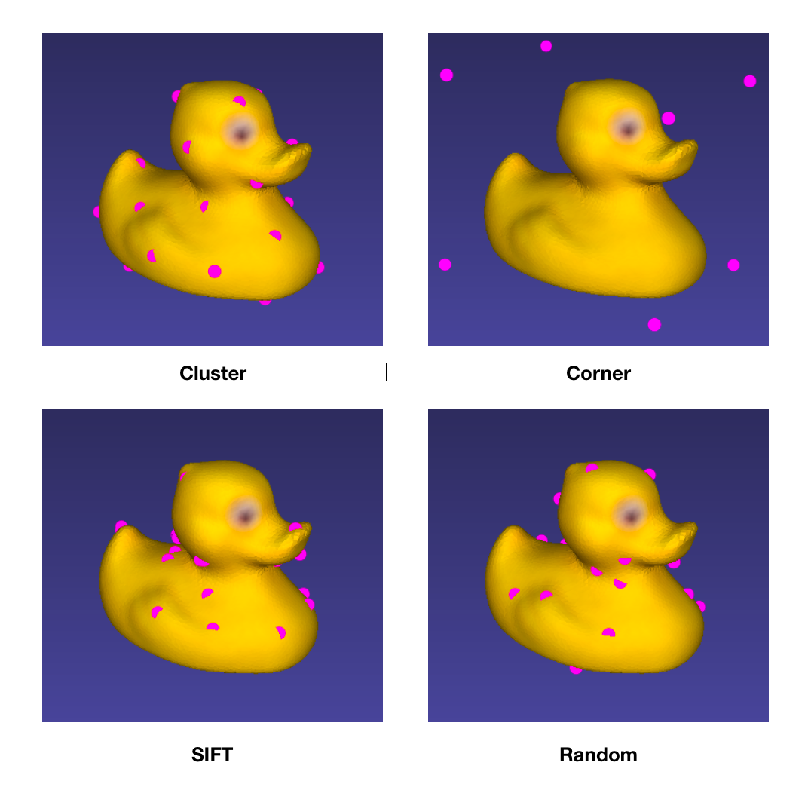

# Keypoints Designator

## How to Generate

### SIFT Keypoints

1. Install PCL libirary. [How to install Point Cloud Library v1.8 (pcl-1.8.0) on Ubuntu 16.04.2 for C++?](https://askubuntu.com/questions/916260/how-to-install-point-cloud-library-v1-8-pcl-1-8-0-on-ubuntu-16-04-2-lts-for)
2. Build and run.
    ```bash
    $ cd pcl-sift
    $ sh build.sh
    $ cd build
    $ ./pcl-sift [input file path] [save file path] [min_scale] [n_octaves] [n_scales_per_octave] [min_contrast]
    ```

### Other Keypoints

Except for SIFT keypoints, we can also generate other kinds of keypoints:

- **Corner keypoints**: 3d corners of the model
- **Random keypoints**: Random surface points
- **Cluster keypoints**: Uniformly clustered surface points

Run following command to generate different kinds of keypoints

```bash
$ python kp.py --num=NUM --type=TYPE
```

## Example



## Parameters

Good SIFT keypoints should be distributed uniformly around the object mesh surface.

| object | min_scale | n_octaves | n_scales_per_octave | min_contrast | # keypoints |
| --- | --- | --- | --- | --- | --- |
| 01 ape | 0.3 | 10 | 8 | 0.158 | 30 |
| | 0.2 | 10 | 8 | 0.265 | 17 |
| | 0.2 | 10 | 8 | 0.4 | 9 |
| 02 benchvise | 0.2 | 10 | 8 | 0.671 | 30 |
| | | | | 1.0 | 17 |
| | | | | 1.4 | 9 |
| 03 bowl | 0.2 | 10 | 8 | 0.306 | 30 |
| | | | | 0.42 | 17 |
| | | | | 0.8 | 9 |
| 04 camera | 0.2 | 10 | 8 | 0.247 | 30 |
| | | | | 0.3285 | 17 |
| | | | | 0.46 | 9 |
| 05 can | 0.2 | 10 | 8 | 0.512 | 30 |
| | | | | 0.7725 | 17 |
| | | | | 1.38 | 9 |
| 06 cat | 0.2 | 10 | 8 | 0.32 | 30 |
| | | | | 0.625 | 17 |
| | | | | 0.77 | 9 |
| 07 cup | 0.2 | 10 | 8 | 0.2444 | 30 |
| | | | | 0.3385 | 17 |
| | | | | 0.69 | 9 |
| 08 driller | 0.2 | 10 | 8 | 0.425 | 30 |
| | | | | 0.7 | 17 |
| | | | | 1.25 | 9 |
| 09 duck | 0.2 | 10 | 8 | 0.19 | 30 |
| | | | | 0.26 | 17 |
| | | | | 0.35 | 17 |
| 10 eggbox | 0.2 | 10 | 8 | 0.27 | 30 |
| | | | | 0.4 | 17 |
| | | | | 1.05 | 17 |
| 11 glue | 0.2 | 10 | 8 | 0.21799 | 30 |
| | | | | 0.28 | 17 |
| | | | | 0.4 | 9 |
| 12 holepuncher | 0.2 | 10 | 8 | 0.489 | 30 |
| | | | | 0.57 | 17 |
| | | | | 0.7 | 9 |
| 13 iron | 0.2 | 10 | 8 | 0.575 | 30 |
| | | | | 0.7225 | 17 |
| | | | | 1.25 | 9 |
| 14 lamp | 0.2 | 10 | 8 | | 30 |
| | | | | 0.97 | 17 |
| | | | | 1.475 | 9 |
| 15 phone | 0.2 | 10 | 8 | 0.3175 | 30 |
| | | | | 0.43 | 17 |
| | | | | 0.75 | 9 |
